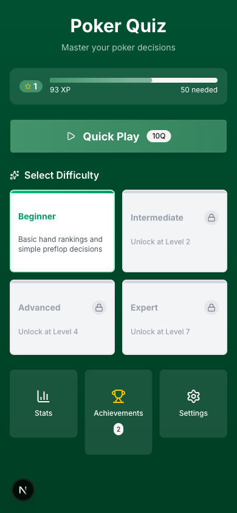
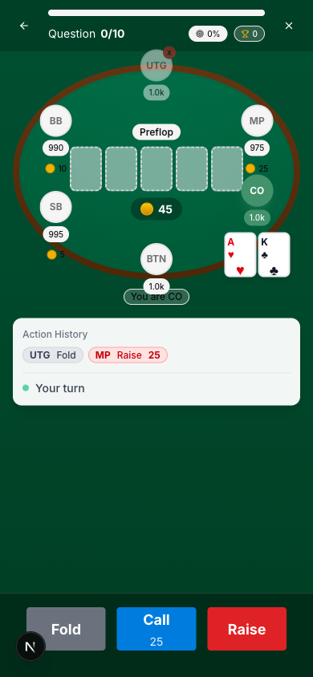
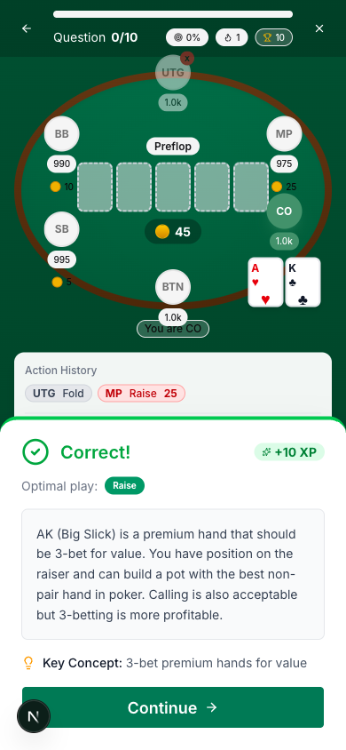

<div align="center">
  

  # Poker Quiz

  **Master poker decision-making through interactive scenarios**

  [](https://github.com/tyloo/poker-quiz/actions/workflows/ci.yml)
  [](https://opensource.org/licenses/MIT)
  [](https://nextjs.org/)
  [](https://www.typescriptlang.org/)

  [Live Demo](https://pq.tyloo.fr) · [Report Bug](https://github.com/tyloo/poker-quiz/issues) · [Request Feature](https://github.com/tyloo/poker-quiz/issues)
</div>

---

## About

Poker Quiz is a mobile-first web application designed to help players improve their poker decision-making skills through interactive quiz scenarios. Practice preflop and postflop decisions, learn key concepts, and track your progress as you level up.

<div align="center">
  
  
  
</div>

## Features

### Interactive Poker Scenarios
- **80+ curated scenarios** across all difficulty levels
- **4 difficulty tiers**: Beginner, Intermediate, Advanced, Expert
- Covers **preflop, flop, turn, and river** decisions
- Realistic hand situations with detailed explanations

### Progression System
- **XP-based leveling** with smooth progression curve
- **Unlock new difficulties** as you level up
- **Streak bonuses** for consecutive correct answers
- **Achievement system** with XP rewards

### Learning Experience
- **Detailed explanations** for every scenario
- **Key concepts** highlighted for each decision
- **Immediate feedback** on your choices
- Topics include: value betting, bluffing, pot odds, position play, and more

### Statistics & Tracking
- Track accuracy by **difficulty, street, and action type**
- View your **best streaks** and total progress
- **Session summaries** with performance breakdown
- All progress **saved locally** - no account required

## Tech Stack

- **Framework**: [Next.js 16](https://nextjs.org/) with App Router
- **Language**: [TypeScript](https://www.typescriptlang.org/)
- **Styling**: [Tailwind CSS 4](https://tailwindcss.com/)
- **UI Components**: [Radix UI](https://www.radix-ui.com/) + [shadcn/ui](https://ui.shadcn.com/)
- **State Management**: [Zustand](https://zustand-demo.pmnd.rs/)
- **Icons**: [Lucide](https://lucide.dev/)

## Getting Started

### Prerequisites

- Node.js 18.17 or later
- pnpm (recommended) or npm

### Installation

1. Clone the repository
   ```bash
   git clone https://github.com/tyloo/poker-quiz.git
   cd poker-quiz
   ```

2. Install dependencies
   ```bash
   pnpm install
   ```

3. Start the development server
   ```bash
   pnpm dev
   ```

4. Open [http://localhost:3000](http://localhost:3000) in your browser

### Build for Production

```bash
pnpm build
pnpm start
```

## Project Structure

```
poker-quiz/
├── app/                    # Next.js App Router pages
│   ├── achievements/       # Achievements page
│   ├── quiz/              # Quiz and summary pages
│   ├── settings/          # Settings page
│   └── stats/             # Statistics page
├── components/
│   ├── game/              # Game-specific components
│   ├── poker/             # Poker table and card components
│   └── ui/                # Reusable UI components
├── lib/
│   ├── data/              # Scenario data
│   ├── game/              # Game logic (leveling, achievements)
│   ├── hooks/             # Custom React hooks
│   ├── store/             # Zustand store
│   └── types/             # TypeScript types
└── public/                # Static assets
```

## Difficulty Progression

| Level | XP Required | Unlocks |
|-------|-------------|---------|
| 1 | 0 | Beginner scenarios |
| 2 | 50 | Intermediate scenarios |
| 4 | 220 | Advanced scenarios |
| 7 | 730 | Expert scenarios |

## Contributing

Contributions are welcome! Please read our [Contributing Guide](CONTRIBUTING.md) for details on our code of conduct and the process for submitting pull requests.

### Adding New Scenarios

Scenarios are defined in `lib/data/scenarios.ts`. Each scenario includes:
- Hand cards and board
- Player positions and stacks
- Action history
- Valid actions and optimal play
- Explanation and key concept

## License

This project is licensed under the MIT License - see the [LICENSE](LICENSE) file for details.

## Acknowledgments

- Poker strategy concepts inspired by modern GTO and exploitative play theory
- UI design influenced by mobile-first quiz applications
- Built with [Next.js](https://nextjs.org/) and [Vercel](https://vercel.com/)

---

<div align="center">
  Made with ♠️ ♥️ ♦️ ♣️ by <a href="https://github.com/tyloo">Tyloo</a>
</div>
